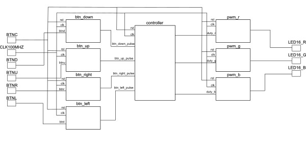
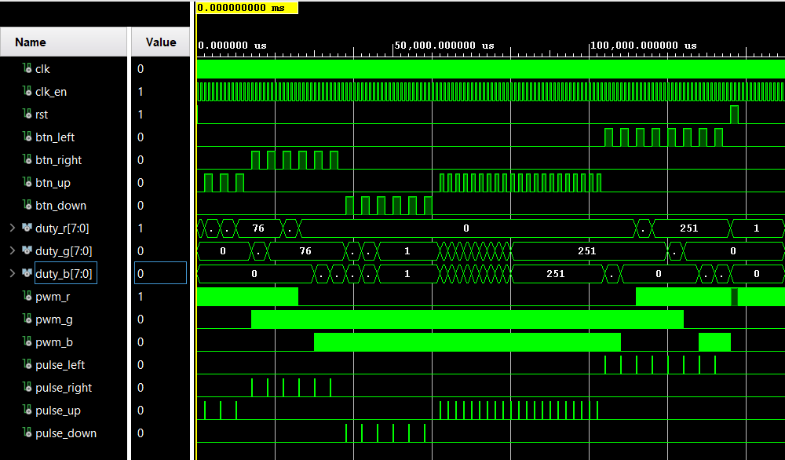
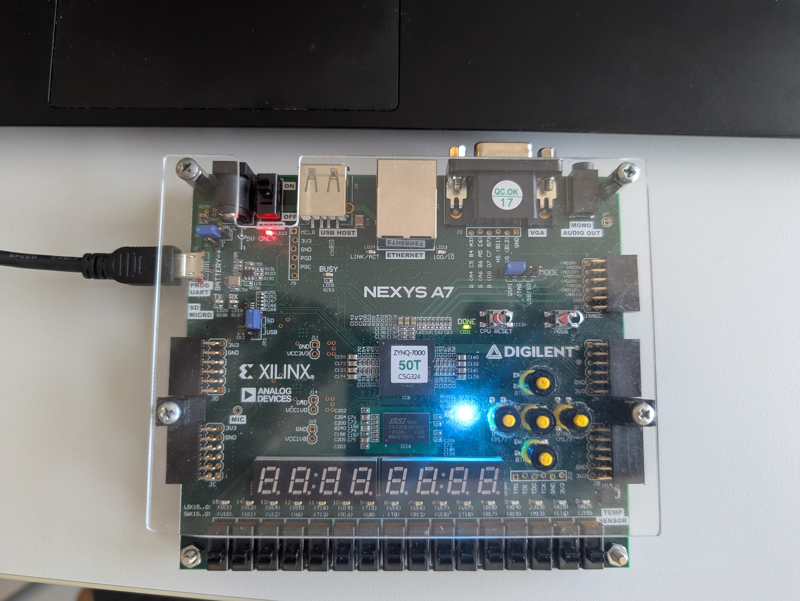

# PWM pre ovládanie RGB LED

## Členovia tímu

* Lukáš Hrobák - písanie kódu
* Richard Tomanička - dokumentácia, schéma
* Jan Trojak - testbench, písanie kódu

## Abstrakt

Cieľom tohto projektu bolo navrhnúť a implementovať viackanálový systém pulznej šírkovej modulácie (PWM) pre presné riadenie jasu RGB LED diódy na vývojovej doske Nexys A7-50T. Naše riešenie umožňuje intuitívne ovládanie jasu a farieb jednej RGB LED diódy prostredníctvom piatich tlačidiel. Stlačením tlačidiel je možné dynamicky meniť jas LED (úpravou striedy PWM signálu) v deviatich diskrétnych úrovniach a zároveň prepínať medzi dvanástimi prednastavenými farbami (moduláciou intenzity jednotlivých farebných kanálov – červenej, zelenej a modrej). Celá riadiaca logika PWM a spracovanie vstupov z tlačidiel boli implementované v jazyku VHDL, čo zaručuje presné časovanie a okamžitú odozvu systému. Výsledný návrh poskytuje užívateľsky prívetivé a flexibilné ovládanie svetelného výstupu RGB LED diódy.

## Popis hardvéru a ovládanie demo verzie

Náš projekt je implementovaný na vývojovej doske Nexys A7-50T od spoločnosti Digilent. Táto doska poskytuje potrebné rozhrania a komponenty pre realizáciu nášho návrhu.

<ins>Použité komponenty a ich využitie</ins>

* **LED16**: RGB LED dióda, ktorej jas a farba sú riadené výstupnými PWM signálmi.
* **BTNC (button central)**: Tlačidlo pre resetovanie aktuálneho nastavenia jasu na strednú úroveň a farby na predvolenú bielu.
* **BTNU (button up)**: Tlačidlo na zvýšenie aktuálneho jasu LED diódy o jednu úroveň (z deviatich dostupných).
* **BTND (button down)**: Tlačidlo na zníženie aktuálneho jasu LED diódy o jednu úroveň.
* **BTNR (button right)**: Tlačidlo na posun výberu farby doprava v cykle dvanástich prednastavených farieb.
* **BTNL (button left)**: Tlačidlo na posun výberu farby doľava v cykle dvanástich prednastavených farieb.

## Popis softvéru a riadiaca logika

Riadenie jasu a farieb RGB LED diódy je implementované pomocou jazyka VHDL. Naša implementácia zahŕňa niekoľko kľúčových častí:

* **Debouncing a Logika tlačidiel**: Táto časť kódu detekuje stlačenie jednotlivých tlačidiel (BTNC, BTNU, BTND, BTNR, BTNL) a na základe toho aktualizuje vnútorné stavy riadiacej jednotky farieb a jasu. Tlačidlo BTNC slúži na resetovanie jasu na strednú úroveň a farby na predvolenú bielu.

* **Riadiaca jednotka jasu**: Táto časť riadi celkový jas LED diódy. Tlačidlá BTNU a BTND slúžia na zvyšovanie a znižovanie aktuálnej úrovne jasu v deviatich krokoch. Táto úroveň jasu sa následne aplikuje ako škálovací faktor na striedy PWM signálov pre všetky tri farebné kanály, čím sa mení celková intenzita svetla pri zachovaní zvolenej farby.

* **Riadiaca jednotka farieb**: Táto časť logiky spravuje výber aktuálnej farby LED diódy. Na základe stlačenia tlačidiel BTNL a BTNR sa cyklicky prechádza medzi dvanástimi prednastavenými farbami. Každá farba má definované pomery intenzít pre červený, zelený a modrý kanál, ktoré sa následne prenášajú do príslušných PWM generátorov.

* **PWM generátor**: Pre každý farebný kanál (červený, zelený, modrý) je implementovaný PWM generátor. Tieto generátory vytvárajú pulzne šírkovo modulované signály, ktorých strieda (duty cycle) určuje intenzitu daného farebného komponentu a tým aj výsledný jas. Projekt podporuje deväť diskrétnych úrovní jasu, ktoré sú reprezentované rôznymi hodnotami striedy PWM signálu.

### Top level schéma

### Simulácia komponentov

### Fotografie dosky Nexys A7-50T s implementovaným kódom

## Referencie

* [Button debouncing](https://github.com/tomas-fryza/vhdl-labs/tree/master/examples/_debounce)
* [Testbench a Kontrola kódu](https://chatgpt.com/)
* [Constrainový súbor](https://www.google.com/search?q=https://raw.githubusercontent.com/Digilent/digilent-xdc/master/Nexys-A7-50T-Master.xdc)

